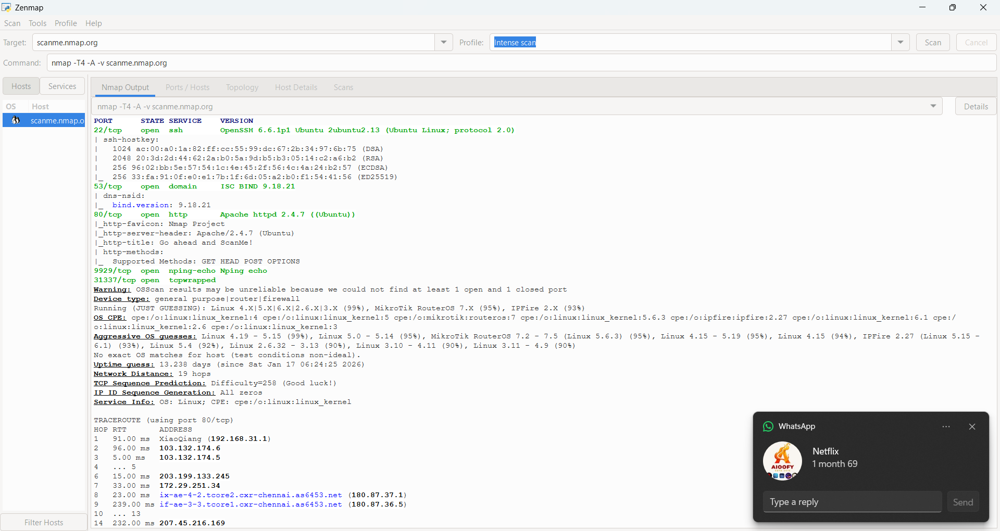
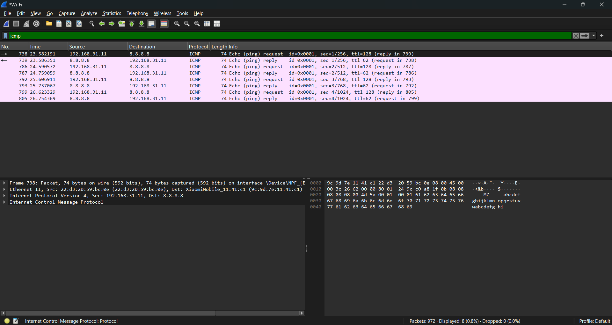

# Cyber Security Internship 

**Intern Name:** Satish Bukki
**Role:** Cyber Security Intern
**Host Company:** Codec Technologies
**Focus Area:** Network Security & VAPT

# Overview
Projects I completed during my internship. The work focuses on **Vulnerability Assessment** and **Network Fundamentals**, demonstrating hands-on experience with industry-standard security tools.

## Project 1: Vulnerability Assessment and Penetration Testing (VAPT)

**Objective:** To conduct a comprehensive vulnerability scan on a target system to identify open ports, service versions, and potential security gaps.

### Tools Used
* **Nmap (Zenmap GUI):** For port scanning, service fingerprinting, and topology mapping.
* **Target:** `scanme.nmap.org` (Authorized testing target).

### Execution Steps
1.  **Configuration:** Launched Zenmap and selected the **"Intense Scan"** profile.
2.  **Command Execution:** The tool executed the command `nmap -T4 -A -v scanme.nmap.org`.
    * `-T4`: Accelerated the scan speed (Aggressive Timing).
    * `-A`: Enabled OS detection, version detection, and script scanning.
3.  **Analysis:** The scan successfully enumerated multiple open ports and services:
    * **Port 80 (HTTP):** Identified 'Apache httpd 2.4.7' running on Ubuntu.
    * **Port 22 (SSH):** Identified 'OpenSSH 6.6.1p1' (Protocol 2.0).
    * **Port 53 (Domain):** Detected 'ISC BIND 9.18.21' DNS service.
    * **Network Path:** Performed a Traceroute (visible in output) to map the 19-hop path to the server.

### Project Output

## Project 2: Network Traffic Analysis (Network Fundamentals)

**Objective:** To capture and analyze live network traffic to understand TCP/IP handshakes and ICMP protocols.

### Tools Used
* **Wireshark:** For packet sniffing and protocol analysis.
* **Command Prompt:** For generating ICMP (Ping) traffic.
* **Interface:** Wi-Fi Adapter.

### Execution Steps
1.  **Setup:** Configured Wireshark to capture traffic on the active **"Wi-Fi"** interface.
2.  **Traffic Generation:** Initiated a connectivity check using the command `ping 8.8.8.8` (Google DNS).
3.  **Filtering:** Applied the `icmp` display filter to isolate relevant packets from background noise (displayed 8 packets out of 972 captured).
4.  **Packet Analysis:**
    * **Echo Request (Packet 738):** Sent from Source `192.168.31.11` to Destination `8.8.8.8`.
    * **Echo Reply (Packet 739):** Received from Source `8.8.8.8` to Destination `192.168.31.11`.
    * **Protocol Details:** Verified the ICMP Type 8 (Request) and Type 0 (Reply) headers in the packet details pane.

### Project Output

## Conclusion
These projects demonstrate the practical application of the **Defensive Security** lifecycle—identifying attack surfaces using Nmap and monitoring network integrity using Wireshark.
